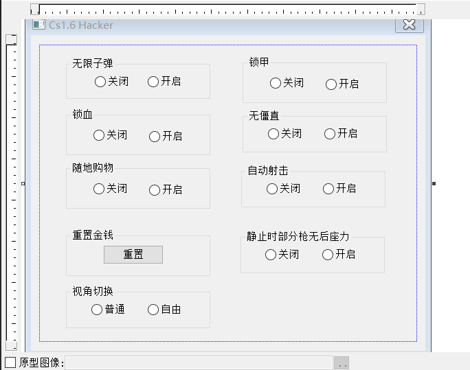

# CSHacker

## 描述

最近没事干，想看看简单的游戏外挂怎么搞的，花了点时间(大概1周左右)写了个CS1.6单机辅助程序，采用Dll注入的方式，其功能是根据b站上一个视频写的，然后视频没讲如何用c++实现，凭借自己所学的知识，用c++来实现了大部分功能。

实现的大部分功能都是内存修改相关的，对于透视，锁定，这种矩阵的挂，还需要去学习矩阵相关的知识点。

最后就是代码并不是很完美，功能开启后，必须关闭后，再再次开启，否则会导致线程多开，并且关掉窗口前，记得关闭所有的功能，否则将导致游戏崩溃(实际上可以在析构函数里面，添加一些代码)。

## 文件结构

- CSHack文件夹，是Mfc Dll的源码
- final文件夹，包含了最后的DLL，和一个简单的注入器，还有CE的一些地址信息。
- package文件夹，一些链接，b站视频链接和游戏版本链接
- img文件夹，一些图片

## 功能如下

无限子弹，锁血，锁甲，随地购物都属于随时修改内存数据

重置金钱和视角切换属于单次修改内存数据

无僵直和静止时部分枪无后座力属于修改内存代码

自动射击属于判断内存数据，然后添加鼠标动作